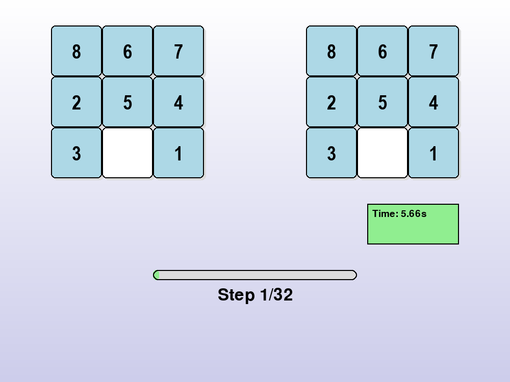
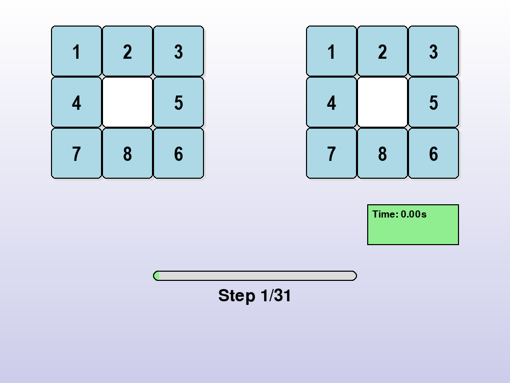
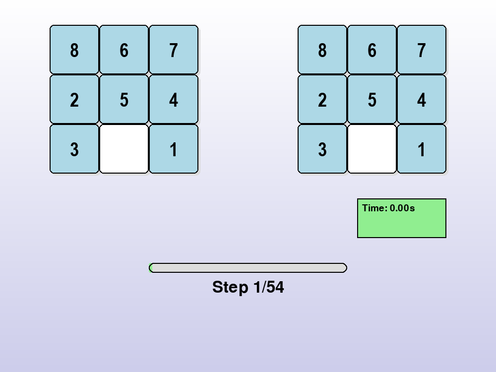
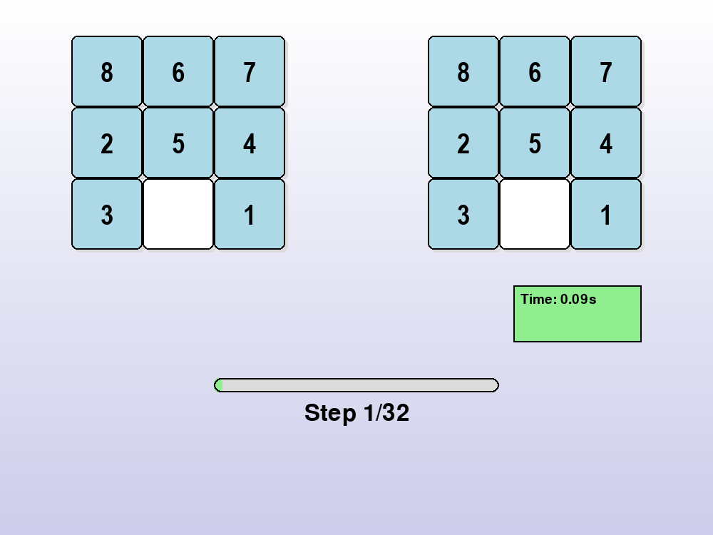

# 1. Mục tiêu
Bài toán giải quyết trò chơi 8-Puzzle thông qua việc triển khai và so sánh hiệu suất của nhiều thuật toán tìm kiếm khác nhau. Hệ thống cung cấp tùy chọn để người dùng trải nghiệm các thuật toán như BFS, DFS, IDS, Uniform Cost, A*, IDA*, Greedy Best-First Search, Hill Climbing (bao gồm các biến thể), Simulated Annealing, Beam Search, Genetic Algorithm, Backtracking, cùng các thuật toán dành cho môi trường không chắc chắn như Uncertain BFS, Search with No Observations và Partially Observable DFS. Giao diện trực quan được thiết kế bằng Pygame giúp mô phỏng toàn bộ quá trình giải quyết bài toán.
# 2. Nội dung

## 2.1. Các thuật toán Tìm kiếm không có thông tin (Uninformed Search)

### Thành phần chính của bài toán tìm kiếm

#### Một bài toán tìm kiếm bao gồm các thành phần cơ bản sau:

- **Không gian trạng thái (State Space):** tập hợp tất cả các trạng thái có thể có của bài toán.
- **Trạng thái ban đầu (Initial State):** điểm bắt đầu quá trình tìm kiếm.
- **Tập hành động (Actions):** tập các hành động có thể thực hiện để chuyển từ trạng thái này sang trạng thái khác.
- **Hàm chuyển trạng thái (Transition Model):** mô tả kết quả của một hành động khi áp dụng lên trạng thái hiện tại.
- **Trạng thái đích (Goal Test):** điều kiện để xác định trạng thái đích đã đạt được.
- **Chi phí đường đi (Path Cost):** tổng chi phí của chuỗi hành động từ trạng thái ban đầu đến trạng thái đích (thường dùng trong tìm kiếm tối ưu như Uniform Cost Search).
#### Solution là gì?
Solution là một chuỗi các hành động hoặc trạng thái dẫn từ trạng thái ban đầu đến trạng thái mục tiêu (goal state). Trong bối cảnh của trò chơi 8-Puzzle, solution chính là chuỗi di chuyển các ô số để biến cấu hình ban đầu thành cấu hình mục tiêu (thường là sắp xếp từ 1–8, với ô trống ở vị trí cuối).
#### Hình ảnh gif của từng thuật toán khi áp dụng lên trò chơi

|  |  |  |  |
|:--------------------------------:|:--------------------------------:|:--------------------------------:|:--------------------------------:|
| **Mô phỏng BFS**                 | **Mô phỏng IDS**                 | **Mô phỏng UCS**                 | **Mô phỏng DFS**                 |
#### Hình ảnh so sánh hiệu suất của các thuật toán

#### Một vài nhận xét về hiệu suất của các thuật toán trong nhóm này khi áp dụng lên trò chơi 8 ô chữ
    •Breadth-First Search (BFS):
        o	Luôn tìm ra lời giải tối ưu (nếu tồn tại).
        o	Tốn nhiều bộ nhớ do cần lưu trữ toàn bộ frontier.
        o	Hiệu quả với lời giải nông, nhưng dễ bị nghẽn với lời giải sâu.
    •Depth-First Search (DFS):
        o	Bộ nhớ thấp, nhưng dễ rơi vào vòng lặp vô hạn nếu không kiểm soát độ sâu.
        o	Không đảm bảo lời giải tối ưu.
    •Iterative Deepening Search (IDS):
        o	Kết hợp ưu điểm của DFS (ít bộ nhớ) và BFS (tìm lời giải tối ưu).
        o	Chi phí thời gian cao hơn do lặp lại tìm kiếm nhiều lần.
    •Uniform Cost Search:
        o	Tìm lời giải có chi phí thấp nhất (nếu chi phí mỗi bước khác nhau).
        o	Nếu mọi bước có cùng chi phí, tương tự như BFS.

## 2.2.	Các thuật toán tìm kiếm có thông tin (Informed Search)
### Thành phần chính của bài toán tìm kiếm
Ngoài các thành phần cơ bản giống tìm kiếm không có thông tin, các thuật toán có thông tin sử dụng thêm một yếu tố rất quan trọng:
•   Hàm heuristic (h(n)): ước lượng chi phí từ một trạng thái n đến trạng thái đích (goal state). Đây là “thông tin bổ sung” giúp hướng dẫn tìm kiếm hiệu quả hơn.
•   Hàm đánh giá (f(n)): tùy theo thuật toán:
    o   Greedy Best-First: f(n) = h(n)
    o   A*: f(n) = g(n) + h(n), trong đó g(n) là chi phí từ trạng thái ban đầu đến n
    o   IDA*: sử dụng A* lặp theo ngưỡng f(n)
Các heuristic phổ biến trong 8-Puzzle:
•   Misplaced Tiles: số ô sai vị trí
•   Manhattan Distance: tổng khoảng cách theo hàng và cột từ mỗi ô đến vị trí đúng của nó (hiệu quả hơn và phổ biến hơn)
#### Solution là gì?
Tương tự, solution là chuỗi hành động chuyển từ trạng thái ban đầu đến trạng thái đích. Với các thuật toán có thông tin, solution thường ngắn hơn và được tìm thấy nhanh hơn do thuật toán được dẫn đường bởi heuristic.
#### Hình ảnh gif của từng thuật toán khi áp dụng lên trò chơi

|  |  |  |
|:--------------------------------:|:--------------------------------:|:--------------------------------:|
| **Mô phỏng Greedy**                 | **Mô phỏng A_Star**                 | **Mô phỏng IDA_Star**                 |
#### Hình ảnh so sánh hiệu suất của các thuật toán

#### Một vài nhận xét về hiệu suất của các thuật toán trong nhóm này khi áp dụng lên trò chơi 8 ô chữ
    • Greedy Best-First Search:
        o	Tìm nhanh do chỉ quan tâm đến h(n)
        o	Không đảm bảo lời giải tối ưu
        o	Có thể bị mắc kẹt nếu heuristic dẫn sai hướng
    • A_Star:
        o	Tìm lời giải tối ưu nếu heuristic là admissible (không vượt quá chi phí thực tế)
        o	Với heuristic tốt (Manhattan), rất hiệu quả cho 8-Puzzle
        o	Tốn nhiều bộ nhớ hơn Greedy
    • IDA_Star:
        o	Hiệu quả về bộ nhớ hơn A* (dùng DFS theo mức f(n))
        o	Tốc độ chậm hơn A* do lặp lại nhiều lần
        o	Cực kỳ hữu ích khi không đủ bộ nhớ cho A*
