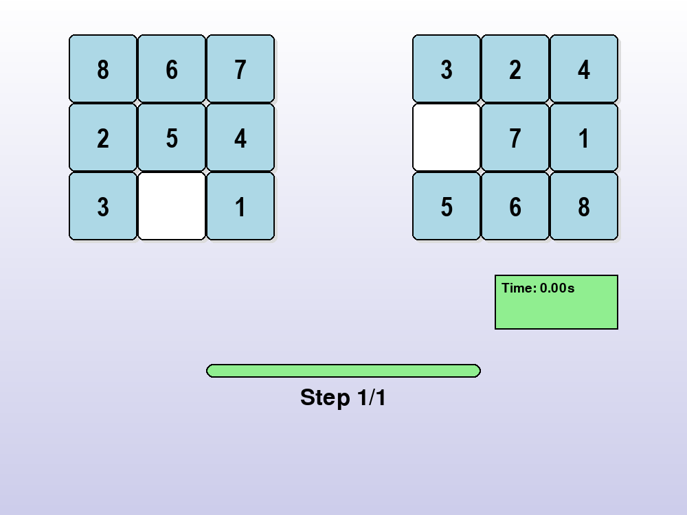

# 1. Mục tiêu

Bài toán giải quyết trò chơi 8-Puzzle thông qua việc triển khai và so sánh hiệu suất của nhiều thuật toán tìm kiếm khác nhau. Hệ thống cung cấp tùy chọn để người dùng trải nghiệm các thuật toán như BFS, DFS, IDS, Uniform Cost, A*, IDA*, Greedy Best-First Search, Hill Climbing (bao gồm các biến thể), Simulated Annealing, Beam Search, Genetic Algorithm, Backtracking, cùng các thuật toán dành cho môi trường không chắc chắn như Uncertain BFS, Search with No Observations và Partially Observable DFS. Giao diện trực quan được thiết kế bằng Pygame giúp mô phỏng toàn bộ quá trình giải quyết bài toán.

# 2. Nội dung

## 2.1. Các thuật toán Tìm kiếm không có thông tin (Uninformed Search)

### Thành phần chính của bài toán tìm kiếm

#### Một bài toán tìm kiếm bao gồm các thành phần cơ bản sau:

- **Không gian trạng thái (State Space):** tập hợp tất cả các trạng thái có thể có của bài toán.
- **Trạng thái ban đầu (Initial State):** điểm bắt đầu quá trình tìm kiếm.
- **Tập hành động (Actions):** tập các hành động có thể thực hiện để chuyển từ trạng thái này sang trạng thái khác.
- **Hàm chuyển trạng thái (Transition Model):** mô tả kết quả của một hành động khi áp dụng lên trạng thái hiện tại.
- **Trạng thái đích (Goal Test):** điều kiện để xác định trạng thái đích đã đạt được.
- **Chi phí đường đi (Path Cost):** tổng chi phí của chuỗi hành động từ trạng thái ban đầu đến trạng thái đích (thường dùng trong tìm kiếm tối ưu như Uniform Cost Search).

### Solution là gì?

Solution là một chuỗi các hành động hoặc trạng thái dẫn từ trạng thái ban đầu đến trạng thái mục tiêu (goal state). Trong bối cảnh của trò chơi 8-Puzzle, solution chính là chuỗi di chuyển các ô số để biến cấu hình ban đầu thành cấu hình mục tiêu (thường là sắp xếp từ 1–8, với ô trống ở vị trí cuối).

### Hình ảnh gif của từng thuật toán khi áp dụng lên trò chơi

|  |  |  |  |
|:--------------------------------:|:--------------------------------:|:--------------------------------:|:--------------------------------:|
| **Mô phỏng BFS**                 | **Mô phỏng IDS**                 | **Mô phỏng UCS**                 | **Mô phỏng DFS**                 |
### Hình ảnh so sánh hiệu suất của các thuật toán

| **Criterion**   | **Breadth-First** | **Uniform Cost** | **Depth-First** | **Iterative Deepening** |
|-----------------|-------------------|------------------|------------------|--------------------------|
| **Hoàn tất (Complete)?**   | Có               | Có              | Không               | semi                     |
| **Tối ưu (Optimal)?**    | Có               | Có              | Không               | Có                      |
| **Độ phức tạp thời gian (Time)**        | O(b^d)            | O(b^{⌈C*/ε⌉})     | O(b^m)           | O(b^d)                   |
| **Độ phức tạp bộ nhớ (Space)**       | O(b^d)            | O(b^{⌈C*/ε⌉})     | O(bm)            | O(bd)                    |

### Một vài nhận xét về hiệu suất của các thuật toán trong nhóm này khi áp dụng lên trò chơi 8 ô chữ

    •Breadth-First Search (BFS):
        o	Luôn tìm ra lời giải tối ưu (nếu tồn tại).
        o	Tốn nhiều bộ nhớ do cần lưu trữ toàn bộ frontier.
        o	Hiệu quả với lời giải nông, nhưng dễ bị nghẽn với lời giải sâu.
    •Depth-First Search (DFS):
        o	Bộ nhớ thấp, nhưng dễ rơi vào vòng lặp vô hạn nếu không kiểm soát độ sâu.
        o	Không đảm bảo lời giải tối ưu.
    •Iterative Deepening Search (IDS):
        o	Kết hợp ưu điểm của DFS (ít bộ nhớ) và BFS (tìm lời giải tối ưu).
        o	Chi phí thời gian cao hơn do lặp lại tìm kiếm nhiều lần.
    •Uniform Cost Search:
        o	Tìm lời giải có chi phí thấp nhất (nếu chi phí mỗi bước khác nhau).
        o	Nếu mọi bước có cùng chi phí, tương tự như BFS.

## 2.2.	Các thuật toán tìm kiếm có thông tin (Informed Search)

### Thành phần chính của bài toán tìm kiếm

Ngoài các thành phần cơ bản giống tìm kiếm không có thông tin, các thuật toán có thông tin sử dụng thêm một yếu tố rất quan trọng:

•   Hàm heuristic (h(n)): ước lượng chi phí từ một trạng thái n đến trạng thái đích (goal state). Đây là “thông tin bổ sung” giúp hướng dẫn tìm kiếm hiệu quả hơn.

•   Hàm đánh giá (f(n)): tùy theo thuật toán:

    o   Greedy Best-First: f(n) = h(n)

    o   A*: f(n) = g(n) + h(n), trong đó g(n) là chi phí từ trạng thái ban đầu đến n

    o   IDA*: sử dụng A* lặp theo ngưỡng f(n)

Các heuristic phổ biến trong 8-Puzzle:

•   Misplaced Tiles: số ô sai vị trí

•   Manhattan Distance: tổng khoảng cách theo hàng và cột từ mỗi ô đến vị trí đúng của nó (hiệu quả hơn và phổ biến hơn)

### Solution là gì?
Tương tự, solution là chuỗi hành động chuyển từ trạng thái ban đầu đến trạng thái đích. Với các thuật toán có thông tin, solution thường ngắn hơn và được tìm thấy nhanh hơn do thuật toán được dẫn đường bởi heuristic.
### Hình ảnh gif của từng thuật toán khi áp dụng lên trò chơi

|  |  |  |
|:--------------------------------:|:--------------------------------:|:--------------------------------:|
| **Mô phỏng Greedy**                 | **Mô phỏng A_Star**                 | **Mô phỏng IDA_Star**                 |

### Hình ảnh so sánh hiệu suất của các thuật toán

| **Tiêu chí**                      | **Greedy Best-First**     | **A\***                           | **IDA\***                              |
| --------------------------------- | ------------------------- | --------------------------------- | -------------------------------------- |
| **Sử dụng Heuristic?**            | Có (chỉ dùng h(n))        | Có (g(n) + h(n))                  | Có (g(n) + h(n))                       |
| **Hoàn tất (Complete)?**          | Không đảm bảo             | Có (nếu heuristic admissible)     | Có (nếu heuristic admissible)          |
| **Tối ưu (Optimal)?**             | Không                     | Có                                | Có                                     |
| **Độ phức tạp thời gian (Time)**  | O(b^m)                    | O(b^d)                            | O(b^d)                                 |
| **Độ phức tạp bộ nhớ (Space)**    | O(b)                      | O(b^d)                            | O(d)                                   |
| **Hiệu quả Heuristic ảnh hưởng?** | Rất lớn                   | Quan trọng nhưng ổn định hơn      | Cực kỳ quan trọng                      |
| **Nhận xét thêm**                 | Nhanh, nhưng dễ sai hướng | Cân bằng giữa tốc độ và chính xác | Dùng ít bộ nhớ hơn A\*, nhưng chậm hơn |

**Chú thích:**

b: branching factor (số nhánh trung bình từ mỗi trạng thái)

d: độ sâu của lời giải tối ưu

m: độ sâu tối đa của không gian trạng thái

### Một vài nhận xét về hiệu suất của các thuật toán trong nhóm này khi áp dụng lên trò chơi 8 ô chữ
    • Greedy Best-First Search:
        o	Tìm nhanh do chỉ quan tâm đến h(n)
        o	Không đảm bảo lời giải tối ưu
        o	Có thể bị mắc kẹt nếu heuristic dẫn sai hướng
    • A_Star:
        o	Tìm lời giải tối ưu nếu heuristic là admissible (không vượt quá chi phí thực tế)
        o	Với heuristic tốt (Manhattan), rất hiệu quả cho 8-Puzzle
        o	Tốn nhiều bộ nhớ hơn Greedy
    • IDA_Star:
        o	Hiệu quả về bộ nhớ hơn A* (dùng DFS theo mức f(n))
        o	Tốc độ chậm hơn A* do lặp lại nhiều lần
        o	Cực kỳ hữu ích khi không đủ bộ nhớ cho A*

## 2.3. Các thuật toán tìm kiếm cục bộ (Local Search)
### Thành phần chính của bài toán tìm kiếm
Tìm kiếm cục bộ là phương pháp không theo dõi toàn bộ đường đi từ trạng thái ban đầu đến đích, mà chỉ quan tâm đến việc cải thiện trạng thái hiện tại. Các thành phần chính bao gồm:

•	Trạng thái hiện tại: một cấu hình của bài toán (ví dụ: cấu trúc 8-Puzzle hiện tại).

•	Hàm đánh giá (Evaluation function): thường là -h(n) (tức là càng ít lỗi thì giá trị càng cao).

•	Láng giềng (Neighbors): các trạng thái có thể đạt được từ trạng thái hiện tại bằng 1 bước di chuyển.

•	Tiêu chí dừng: trạng thái không thể cải thiện thêm (đỉnh cục bộ hoặc cực đại toàn cục).

Không cần lưu toàn bộ đường đi như các thuật toán trước.

### Solution là gì?
Trong local search, “solution” không nhất thiết phải là đường đi tối ưu mà là một trạng thái đủ tốt hoặc cực đại cục bộ gần với trạng thái đích. 
### Hình ảnh gif của từng thuật toán khi áp dụng lên trò chơi

|  |  |  |
|:--------------------------------:|:--------------------------------:|:--------------------------------:|
| **Mô phỏng Simple Hill Climbing**                 | **Mô phỏng Steepest Ascent Hill Climbing**                 | **Mô phỏng Stochastic Hill Climbing**                 |

|  |  |  |
|:--------------------------------:|:--------------------------------:|:--------------------------------:|
| **Mô phỏng Simulated Annealing**                 | **Mô phỏng Beam Search**                 | **Mô phỏng Genetic Algorithm**                 |

### Hình ảnh so sánh hiệu suất của các thuật toán
| **Tiêu chí**                | **Simple Hill Climbing** | **Steepest Ascent HC**  | **Stochastic HC**        | **Simulated Annealing**     | **Beam Search**                | **Genetic Algorithm**             |
| --------------------------- | ------------------------ | ----------------------- | ------------------------ | --------------------------- | ------------------------------ | --------------------------------- |
| **Dựa vào Heuristic?**      | Có                       | Có                      | Có                       | Có                          | Có                             | Có                                |
| **Chiến lược lựa chọn**     | Chọn bước đầu cải thiện  | Chọn bước tốt nhất      | Chọn ngẫu nhiên bước tốt | Có thể chấp nhận bước xấu   | Giữ k beam tốt nhất mỗi bước   | Tạo thế hệ mới từ population      |
| **Khả năng hoàn tất?**      | Không đảm bảo            | Không đảm bảo           | Không đảm bảo            | Có (với xác suất)           | Có                             | Có                                |
| **Tối ưu toàn cục?**        | Không                    | Không                   | Không                    | Có thể (nếu đủ thời gian)   | Không (tùy beam width)         | Có thể (với nhiều thế hệ)         |
| **Chạy thời gian?**         | Nhanh                    | Trung bình              | Trung bình               | Chậm                        | Nhanh nếu beam nhỏ             | Tùy vào số thế hệ                 |
| **Bộ nhớ sử dụng?**         | Thấp                     | Thấp                    | Thấp                     | Trung bình                  | Cao hơn tùy beam size          | Cao (population-based)            |
| **Dễ bị kẹt local optima?** | Cao                      | Cao                     | Trung bình               | Thấp (có thể nhảy khỏi)     | Cao nếu beam nhỏ               | Thấp (do đột biến/chọn lọc)       |
| **Thích hợp khi nào?**      | Bài toán đơn giản        | Có nhiều nhánh chọn lựa | Khi không cần tối ưu     | Bài toán nhiều local optima | Khi muốn đa dạng hóa giải pháp | Bài toán phức tạp, tìm gần tối ưu |

**Chú thích:**

HC: Hill Climbing

Beam width: số trạng thái tốt nhất giữ lại mỗi bước

Population: quần thể trạng thái trong mỗi thế hệ

### Một vài nhận xét về hiệu suất của các thuật toán trong nhóm này khi áp dụng lên trò chơi 8 ô chữ
    • Simple Hill Climbing:
        o	Dễ cài đặt nhưng dễ kẹt tại đỉnh cục bộ.
        o	Không quay lại trạng thái trước đó → có thể thất bại.
    • Steepest Ascent Hill Climbing:
        o	Tốt hơn simple do chọn neighbor tốt nhất.
        o	Nhưng vẫn có thể mắc kẹt tại đỉnh cục bộ hoặc plateau.
    • Stochastic Hill Climbing:
        o	Tránh được phần nào bẫy nhờ tính ngẫu nhiên.
        o	Nhưng vẫn chưa đủ để đảm bảo tìm được đích.
    • Simulated Annealing:
        o	Có khả năng thoát khỏi đỉnh cục bộ nhờ chấp nhận bước "xấu" với xác suất giảm dần.
        o	Hiệu quả nếu cấu hình nhiệt độ hợp lý.
    • Beam Search:
        o	Giữ k trạng thái tốt nhất mỗi bước → cân bằng giữa breadth và focus.
        o	Đôi khi gặp vấn đề nếu tất cả beam đều đi sai hướng.
    • Genetic Algorithm:
        o	Tìm lời giải bằng cách tiến hóa qua nhiều thế hệ.
        o	Hiệu quả nhưng cần điều chỉnh kỹ mutation rate, selection method,...
        o	Có thể tìm được lời giải tốt nhưng không đảm bảo tối ưu.

## 2.4. Các thuật toán tìm kiếm trong môi trường phức tạp (Searching in complex environments)
### Thành phần chính của bài toán tìm kiếm

**Trong môi trường phức tạp (uncertain/partial observable), thuật toán tìm kiếm cần xử lý thêm các yếu tố không chắc chắn như:**

• **Thiếu thông tin trạng thái (partial observability):** không biết chính xác toàn bộ trạng thái hiện tại.

• **Tính bất định trong hành động (uncertainty):** hành động có thể dẫn đến kết quả không như mong đợi.

• **Không quan sát được kết quả hành động (no observation):** hệ thống không phản hồi về trạng thái mới.

**Để thích nghi với các điều kiện này, thuật toán thường phải:**

• Lưu trữ tập hợp các trạng thái có thể (belief states)

• Sử dụng chiến lược dò tìm (exploration)

• Xây dựng chính sách hành động không dựa trên trạng thái cụ thể mà trên tập trạng thái có thể xảy ra

**Một số thuật toán áp dụng:**

• **Uncertain BFS:** Dò tìm theo chiều rộng nhưng chấp nhận xác suất sai lệch.

• **Search with No Observation:** Không thể quan sát phản hồi, chỉ có thể giả định hoặc sử dụng mô hình học.

• **Partially Observable DFS:** Áp dụng DFS với bộ nhớ trạng thái từng thấy, kết hợp giả định để tiến hành tìm kiếm.

### Solution là gì?
Trong môi trường phức tạp, solution không còn là chuỗi hành động cụ thể từ A → Goal, mà là một chính sách hành động (hoặc plan mờ), đủ mạnh để dẫn đến đích từ nhiều trạng thái ban đầu có thể xảy ra.

### Hình ảnh gif của từng thuật toán khi áp dụng lên trò chơi

|  |  |  |
|:--------------------------------:|:--------------------------------:|:--------------------------------:|
| **Mô phỏng Uncertain BFS**                 | **Mô phỏng Search with No Observations**                 | **Mô phỏng Partially Observable DFS**                 |

### Hình ảnh so sánh hiệu suất của các thuật toán

| **Tiêu chí**               | **Uncertain BFS**                                      | **Search with No Observations**                 | **Partially Observable DFS**                 |
| -------------------------- | ------------------------------------------------------ | ----------------------------------------------- | -------------------------------------------- |
| **Khả năng quan sát**      | Quan sát hạn chế và không chắc chắn                    | Không có quan sát                               | Quan sát một phần trạng thái                 |
| **Chiến lược chính**       | Duyệt theo lớp như BFS, nhưng mô hình hóa các khả năng | Hành động mù không phản hồi                     | Duyệt theo chiều sâu kết hợp cập nhật belief |
| **Dựa vào heuristic?**     | Không                                                  | Không                                           | Có thể sử dụng nếu có                        |
| **Hoàn tất (Complete)?**   | Có nếu không gian nhỏ                                  | Không                                           | Có (với giới hạn)                            |
| **Tối ưu?**                | Không đảm bảo                                          | Không                                           | Không đảm bảo                                |
| **Xử lý không chắc chắn?** | Có                                                     | Không                                           | Có                                           |
| **Bộ nhớ sử dụng?**        | Cao nếu không gian trạng thái lớn                      | Thấp                                            | Trung bình                                   |
| **Thời gian chạy?**        | Chậm (do xử lý tất cả các khả năng)                    | Nhanh nhưng kém chính xác                       | Phụ thuộc vào kích thước belief              |
| **Thích hợp khi nào?**     | Khi trạng thái có thể đoán trước phần nào              | Không có cảm biến, hoặc môi trường hoàn toàn mù | Khi có một phần quan sát đáng tin cậy        |

**Chú thích:**

Belief state: trạng thái niềm tin (tập hợp các trạng thái có thể đang xảy ra).

Các thuật toán này thường sử dụng trong môi trường dạng POMDP (Partially Observable Markov Decision Process).

### Một vài nhận xét về hiệu suất của các thuật toán trong nhóm này khi áp dụng lên trò chơi 8 ô chữ
    • Uncertain BFS:
        o Dễ triển khai từ BFS thông thường bằng cách thêm xác suất và kiểm tra nhiều hướng
        o Hiệu quả nếu xác suất lỗi thấp, nhưng chi phí tăng nhanh theo độ bất định
    • Search with No Observations:
        o Khó triển khai do không có phản hồi từ môi trường
        o Thường phải dựa vào thử sai → hiệu suất thấp, mất kiểm soát đường đi
    • Partially Observable DFS:
        o Cân bằng giữa mở rộng sâu và lưu trữ tập trạng thái
        o Hiệu quả nếu môi trường bán quan sát được
        o Tuy nhiên, dễ mắc kẹt nếu giả định ban đầu sai

## 2.5. Các thuật toán tìm kiếm trong môi trường phức tạp – Constraint Satisfaction Problems (CSPs)
### Thành phần chính của bài toán tìm kiếm
Trong môi trường phức tạp, các bài toán CSP yêu cầu tìm giá trị biến sao cho thỏa mãn tất cả ràng buộc (constraints). Khi trạng thái ban đầu không đầy đủ hoặc có bất định, việc giải CSP trở nên thách thức hơn.
**Các yếu tố cần được xem xét:**
•	Không gian trạng thái khổng lồ: số tổ hợp biến và miền giá trị lớn.

•	Ràng buộc phức tạp: có thể là ràng buộc toàn cục hoặc cục bộ, không dễ kiểm tra.

•	Thông tin không đầy đủ hoặc động: biến có thể thay đổi hoặc bị ảnh hưởng từ môi trường.

**Để xử lý môi trường phức tạp, các thuật toán giải CSP cần:**

•	Tìm kiếm có giới hạn (constraint propagation) để loại trừ sớm các giá trị không hợp lệ.

•	Backtracking có cải tiến để tránh lặp lại các sai lầm đã biết.

•	Lập kế hoạch mềm (flexible planning) nếu ràng buộc có thể nới lỏng.

•	Học từ quá trình giải để thích nghi trong môi trường không xác định.

- **Một số thuật toán áp dụng:**
1. Backtracking:

    •	Thử giá trị cho từng biến theo thứ tự và quay lui khi phát hiện xung đột.

    •	Đơn giản nhưng dễ bị mắc kẹt ở nhánh sai.

2. Backtracking with Forward Checking:

    •	Trước khi gán giá trị cho biến, kiểm tra các biến chưa gán có còn giá trị hợp lệ hay không.

    •	Giảm số lượng backtrack, tránh sớm các lựa chọn vô ích.

3. Min-Conflicts Heuristic (Local Search CSP):

    •	Khởi tạo lời giải ngẫu nhiên và lặp lại bằng cách thay đổi giá trị của biến gây xung đột nhiều nhất.

    •	Phù hợp với bài toán CSP lớn, cho phép sai số tạm thời để tối ưu dần.

### Solution là gì?
Trong bài toán CSP, solution là một ánh xạ giữa các biến và giá trị sao cho tất cả các ràng buộc đều được thỏa mãn. Trong môi trường phức tạp (có thể thay đổi hoặc thiếu quan sát), solution đôi khi phải là tập hợp các gán giá trị khả thi hoặc kế hoạch thích nghi được với nhiều cấu hình ràng buộc.

### Hình ảnh gif của từng thuật toán khi áp dụng lên trò chơi

### Hình ảnh so sánh hiệu suất của các thuật toán

| **Tiêu chí**               | **Backtracking**                                          | **Backtracking + Forward Checking**                            | **Min-Conflicts Heuristic**                                      |
| -------------------------- | --------------------------------------------------------- | -------------------------------------------------------------- | ---------------------------------------------------------------- |
| **Chiến lược chính**       | Thử từng giá trị, quay lui khi vi phạm ràng buộc          | Giống Backtracking nhưng loại trừ sớm các giá trị không hợp lệ | Tìm lời giải bằng cách giảm số xung đột hiện tại                 |
| **Tối ưu?**                | Có nếu duyệt toàn bộ không gian                           | Có (tốt hơn do loại sớm các giá trị không hợp lệ)              | Không đảm bảo tối ưu, có thể mắc kẹt cục bộ                      |
| **Hoàn tất (Complete)?**   | Có nếu không gian nhỏ                                     | Có, nhanh hơn so với Backtracking cơ bản                       | Không (có thể không tìm thấy lời giải nếu không đủ bước)         |
| **Dựa vào heuristic?**     | Không (trừ khi kết hợp thêm chiến lược chọn biến/giá trị) | Có thể kết hợp thêm heuristics như MRV, LCV                    | Có — luôn dùng hàm đánh giá số xung đột                          |
| **Xử lý không chắc chắn?** | Không                                                     | Không                                                          | Có thể thích nghi tốt với ràng buộc mềm hoặc động                |
| **Bộ nhớ sử dụng?**        | Thấp                                                      | Trung bình (do lưu thông tin forward checking)                 | Rất thấp (local search không lưu toàn bộ cây)                    |
| **Thời gian chạy?**        | Chậm nếu không gian lớn                                   | Nhanh hơn backtracking thường                                  | Rất nhanh với bài toán lớn, nhưng không luôn tìm được lời giải   |
| **Thích hợp khi nào?**     | Bài toán nhỏ hoặc vừa, không cần tối ưu tốc độ            | Bài toán vừa đến lớn, có nhiều ràng buộc chặt chẽ              | Bài toán CSP lớn (như map coloring, n-queen), cần lời giải nhanh |
| **Nhược điểm chính**       | Dễ rơi vào không gian không lời giải                      | Tốn thêm chi phí kiểm tra forward                              | Có thể lặp vô hạn hoặc mắc kẹt cục bộ                            |

### Một vài nhận xét về hiệu suất của các thuật toán trong nhóm này khi áp dụng lên trò chơi 8 ô chữ
    • Backtracking:
        o Cấu trúc đơn giản nhưng dễ rơi vào dead-end.
        o Phù hợp với bài toán nhỏ hoặc ràng buộc ít.
    • Forward Checking:
        o Cải thiện tốc độ đáng kể bằng cách loại trừ giá trị sớm.
        o Tuy nhiên không phát hiện được ràng buộc sâu hơn giữa các biến.
    • Min-Conflicts:
        o Rất nhanh trong các bài toán lớn, chấp nhận giải gần đúng.
        o Không đảm bảo lời giải nếu không cẩn thận chọn hàm đánh giá.